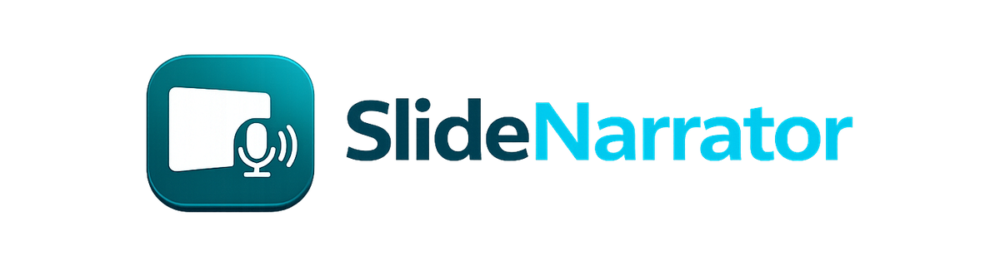

<p align="center">
  
</p>

**Slide Narrator** è un'applicazione desktop per Windows che trasforma una presentazione PowerPoint in:

- un nuovo file `.pptx` con narrazione audio incorporata;
- un video `.mp4` composto dalle slide e dalla relativa narrazione;
- sottotitoli `.srt`, report delle durate e dati di sincronizzazione in JSON.

Lo script da leggere può essere caricato da un file Excel oppure dalle note delle slide. Ogni riga della colonna scelta nel file `.xlsx` corrisponde a una slide.

## Funzioni principali

- Interfaccia grafica moderna con navigazione laterale e procedura guidata.
- Sintesi vocale online con voci Microsoft tramite Edge TTS.
- Supporto opzionale a PocketTTS, Chatterbox TTS e Coqui XTTS per voci locali.
- Importazione o registrazione di campioni vocali, con libreria locale delle voci.
- Generazione di PowerPoint con audio, autoplay e avanzamento automatico opzionale.
- Modalità **Fix** per completare o riparare presentazioni già sonorizzate.
- Esportazione video 720p o 1080p tramite PowerPoint o LibreOffice, FFmpeg e PyMuPDF.
- Sottotitoli, dissolvenze, report delle durate e file `_captions.json`.
- Elaborazione batch tramite manifest JSON.
- Cache degli audio già generati e sintesi concorrente.

## Requisiti

### Base

- Windows 10 o Windows 11.
- Python da 3.10 a 3.14, preferibilmente a 64 bit.
- Connessione Internet per le voci Microsoft Edge TTS.

Durante l'installazione di Python, attivare **Add Python to PATH**.

### Funzioni opzionali

| Funzione | Requisito |
|---|---|
| Esportazione video | FFmpeg, PyMuPDF e PowerPoint oppure LibreOffice |
| Registrazione dal microfono | `sounddevice` |
| PocketTTS / Chatterbox | Dipendenze in `requirements-clone.txt` |
| Coqui XTTS | Dipendenze in `requirements-xtts.txt` e rispetto della licenza del modello |

I modelli vocali locali possono richiedere diversi gigabyte di spazio e molta RAM.


## Installazione degli strumenti dall'app

Nella pagina **Impostazioni → Strumenti e tecnologie** puoi controllare e installare i componenti esterni usati da Slide Narrator:

- **FFmpeg**, per montaggio audio/video e sottotitoli;
- **LibreOffice**, come motore alternativo per il rendering delle slide;
- **Microsoft PowerPoint**, con collegamento alla pagina Microsoft 365 quando non è installato.

Su Windows, i pulsanti di installazione usano **WinGet** e mostrano lo stato aggiornato dei componenti. I motori vocali locali come PocketTTS, Chatterbox e XTTS non possono essere aggiunti a un EXE già compilato: devono essere installati nell'ambiente sorgente e inclusi in una nuova build.

## Installazione rapida su Windows

1. Clonare la repository:

   ```powershell
   git clone https://github.com/Lorix04/SlideNarrator.git
   cd SlideNarrator
   ```

2. Avviare:

   ```text
   Installa_Slide_Narrator.bat
   ```

3. Al termine, aprire:

   ```text
   Avvia_Slide_Narrator.bat
   ```

L'installer crea un runtime isolato in `%LOCALAPPDATA%\SlideNarrator`, installa le dipendenze base e propone l'installazione delle funzioni opzionali.

In caso di installazione danneggiata, usare:

```text
Ripara_Installazione_Slide_Narrator.bat
```

Per rimuovere il runtime e le tecnologie installate per il progetto, lasciando Python intatto:

```text
Disinstalla_Componenti_Slide_Narrator.bat
```

> **Nota sui motori opzionali:** PocketTTS, Chatterbox e Coqui XTTS non sono necessari per usare Edge TTS. Un messaggio di Transformers relativo all'assenza di PyTorch indica soltanto che i modelli locali opzionali non sono disponibili.

## Installazione manuale

```powershell
python -m venv .venv
.venv\Scripts\activate
python -m pip install --upgrade pip
pip install -r requirements.txt
python slide_narrator_gui.py
```

Per le voci locali:

```powershell
pip install -r requirements-clone.txt
```

Per XTTS:

```powershell
pip install -r requirements-xtts.txt
```

## Preparazione dei file

### Presentazione PowerPoint

Usare una presentazione originale `.pptx`. Per cambiare voce o script è consigliabile ripartire sempre dal file originale, senza audio già incorporato. La modalità **Fix** è destinata alla riparazione controllata di file già sonorizzati.

### Script Excel

Per impostazione predefinita, il file `.xlsx` contiene un testo per slide nella colonna A:

| Cella | Contenuto |
|---|---|
| A1 | Testo della slide 1 |
| A2 | Testo della slide 2 |
| A3 | Testo della slide 3 |

È possibile scegliere un altro foglio, un'altra colonna, indicare la presenza di un'intestazione oppure leggere il testo dalle note PowerPoint.

## Utilizzo dall'interfaccia grafica

1. Scegliere il tipo di elaborazione: PowerPoint, video o Fix.
2. Selezionare la presentazione e la sorgente degli script.
3. Scegliere voce, velocità, volume e tonalità.
4. Configurare autoplay, avanzamento, sottotitoli e opzioni video.
5. Avviare la generazione e attendere il completamento.

## Utilizzo da riga di comando

PowerPoint narrato:

```powershell
python slide_narrator.py input.pptx scripts.xlsx output_audio.pptx
```

Con opzioni:

```powershell
python slide_narrator.py input.pptx scripts.xlsx output_audio.pptx --voice it-IT-IsabellaNeural --rate +5% --auto-advance
```

Video:

```powershell
python slide_narrator.py input.pptx scripts.xlsx output_video.mp4 --video --resolution 1080p --subtitles --transition
```

Per visualizzare tutte le opzioni:

```powershell
python slide_narrator.py --help
```

## Elaborazione batch

Modificare `ESEMPIO_BATCH.json`, quindi trascinarlo su `Avvia_Batch_Slide_Narrator.bat` oppure eseguire:

```powershell
Avvia_Batch_Slide_Narrator.bat ESEMPIO_BATCH.json
```

## File generati

Esempio PowerPoint:

```text
corso_audio.pptx
corso_audio_durate.txt
corso_audio_captions.json
```

Esempio video:

```text
corso_video.mp4
corso_video.srt
corso_video_durate.txt
```

## Struttura essenziale

```text
SlideNarrator/
├── slide_narrator.py
├── slide_narrator_gui.py
├── slide_narrator_gui_legacy.py
├── slide_narrator_batch.py
├── slide_narrator_bootstrap.py
├── video_export.py
├── voice_clone.py
├── voice_library.py
├── voice_manager.py
├── verifica_installazione.py
├── requirements.txt
├── requirements-clone.txt
├── requirements-xtts.txt
├── requirements-build.txt
├── SECURITY.md
├── Build_EXE_SlideNarrator.bat
├── Build_EXE_CustomBootloader_SlideNarrator.bat
├── Verifica_RELEASE_SlideNarrator.bat
├── Firma_RELEASE_SlideNarrator.bat
├── Build_Installer_SlideNarrator.bat
├── packaging/
│   └── windows/
│       ├── SlideNarrator.manifest
│       ├── SlideNarrator.version.txt
│       └── Verifica_RELEASE_SlideNarrator.ps1
├── installer/
│   └── SlideNarrator.iss
├── assets/
│   ├── slide_narrator_logo.png
│   ├── slide_narrator_icon.png
│   ├── slide_narrator_icon_sidebar.png
│   └── slide_narrator_icon.ico
├── Installa_Slide_Narrator.bat
├── Installa_Slide_Narrator.ps1
├── Avvia_Slide_Narrator.bat
├── Avvia_Slide_Narrator.ps1
├── Ripara_Installazione_Slide_Narrator.bat
├── Ripara_Installazione_Slide_Narrator.ps1
├── Disinstalla_Componenti_Slide_Narrator.bat
├── Avvia_Batch_Slide_Narrator.bat
├── Avvia_Batch_Slide_Narrator.ps1
└── ESEMPIO_BATCH.json
```

La cartella `voices/` viene creata automaticamente e non deve contenere registrazioni personali nella repository.

Il logo orizzontale e l'icona ufficiale sono conservati in `assets/`. Il PNG principale viene usato nella finestra, la variante compatta nella sidebar e il file `.ico` fornisce le risoluzioni Windows per barra del titolo, taskbar e collegamenti.

## Privacy e sicurezza

Non pubblicare:

- registrazioni vocali personali o campioni senza consenso;
- token, password, chiavi API o file `.env`;
- ambienti virtuali, cache, file generati o log locali.

Usare la clonazione vocale solo con il consenso della persona interessata e nel rispetto delle norme applicabili.

## Limitazioni note

- Le voci Microsoft richiedono Internet.
- Il video usa immagini renderizzate delle slide e non conserva le animazioni native di PowerPoint.
- La resa con LibreOffice può differire leggermente da Microsoft PowerPoint.
- Le voci locali possono essere lente su CPU e consumare molta memoria.
- La modalità INT8 di PocketTTS è sperimentale.

## Licenze

Le dipendenze e i modelli vocali possono avere licenze differenti. Verificare sempre le condizioni del motore e del modello scelto, soprattutto prima di distribuire o vendere contenuti generati.

Questa repository non include un file di licenza generale: aggiungerne uno prima di autorizzare esplicitamente il riutilizzo del codice.


## Creare una release Windows con meno falsi positivi

Per generare la versione portabile esegui su Windows:

```text
Build_EXE_SlideNarrator.bat
```

Lo script crea un ambiente di compilazione nuovo a ogni build, installa soltanto le dipendenze dichiarate e produce:

```text
dist\SlideNarrator\SlideNarrator.exe
release\SlideNarrator_2.9.0_Windows_x64_portable.zip
release\SlideNarrator_2.9.0_Windows_x64_portable.zip.sha256.txt
```

La release usa PyInstaller in modalità **onedir**, non `onefile`, e disabilita UPX. Include inoltre icona, manifest `asInvoker`, informazioni di versione e metadati della build. La cartella completa `dist\SlideNarrator` deve restare unita: non distribuire soltanto l’EXE.

### Bootloader personalizzato

PyInstaller documenta che compilare localmente il bootloader può ridurre i falsi positivi associati all’uso diffuso dei bootloader precompilati. Dopo aver installato Visual Studio C++ Build Tools puoi usare:

```text
Build_EXE_CustomBootloader_SlideNarrator.bat
```

La modalità personalizzata richiede più tempo e non sostituisce la firma digitale.

### Verifica e firma

Esegui:

```text
Verifica_RELEASE_SlideNarrator.bat
```

Il controllo genera hash SHA-256, verifica l’eventuale firma Authenticode e avvia una scansione personalizzata con Microsoft Defender quando `MpCmdRun.exe` è disponibile.

Per una distribuzione pubblica è raccomandata una firma Authenticode attendibile. Dopo aver installato il certificato nell’archivio certificati Windows:

```bat
set "SLIDENARRATOR_CERT_SUBJECT=Nome esatto dell'editore"
Firma_RELEASE_SlideNarrator.bat
```

Un certificato autofirmato è utile solo in ambienti controllati e non costruisce reputazione pubblica.

### Installer

Dopo la build portabile, con Inno Setup installato esegui:

```text
Build_Installer_SlideNarrator.bat
```

L’installer viene creato in:

```text
installer\output\SlideNarrator_Setup_2.9.0.exe
```

Firma anche l’installer prima della pubblicazione. Carica il file finale nella sezione **GitHub Releases**, insieme all’hash SHA-256; non aggiungerlo alla cronologia Git.

Consulta anche [`SECURITY.md`](SECURITY.md). Non chiedere agli utenti di disabilitare l’antivirus o creare esclusioni.

## Baseline Tkinter e sviluppo della nuova interfaccia

La versione stabile precedente alla migrazione PySide6/QML è documentata in:

- [`docs/TKINTER_BASELINE.md`](docs/TKINTER_BASELINE.md)
- [`docs/FUNCTIONAL_INVENTORY_TKINTER.md`](docs/FUNCTIONAL_INVENTORY_TKINTER.md)

Dopo aver pubblicato e verificato l'ultimo commit di `main`, eseguire `Congela_Versione_Tkinter.bat` per creare il tag annotato `v2.9.0-tkinter` e il branch `feature/pyside6-ui`.

L'integrità della baseline può essere controllata con:

```bash
python tools/verify_tkinter_baseline.py
```
